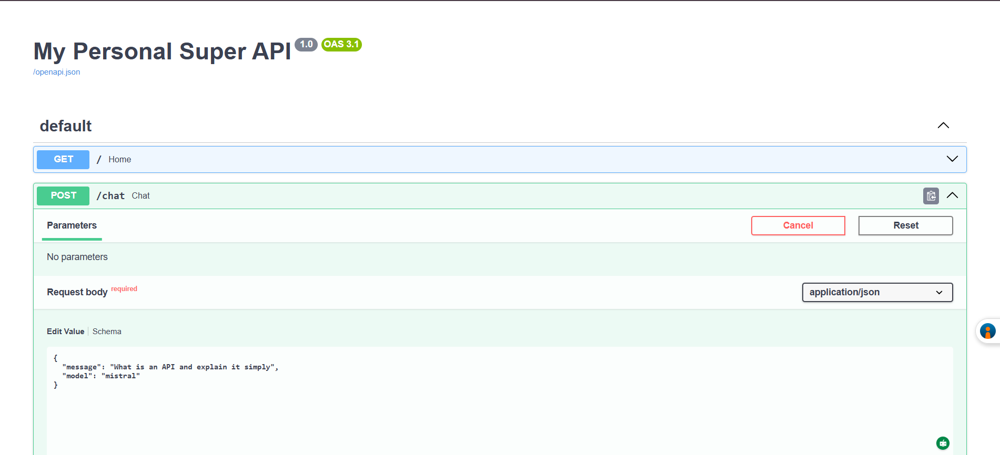
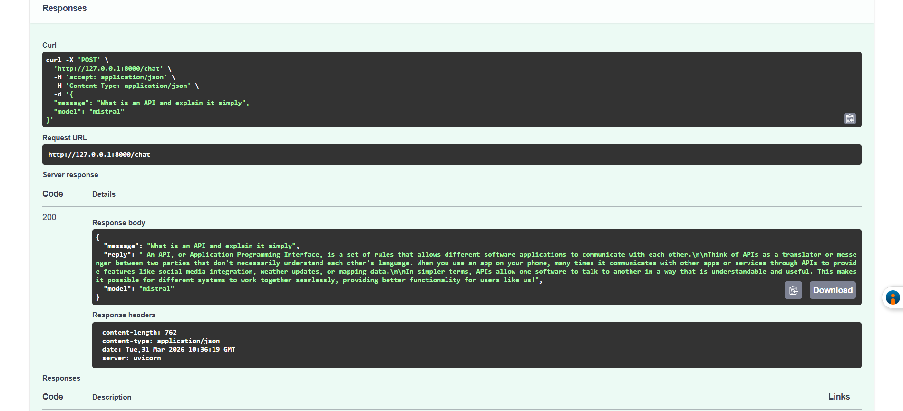
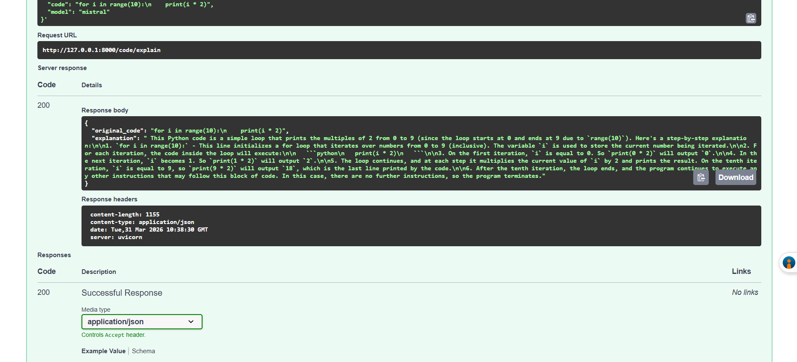
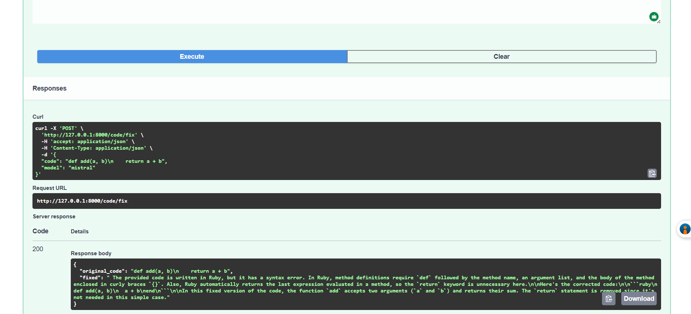

<div align="center">

# 🚀 Personal Super API

### My own private AI-powered API — running fully offline on my laptop

[](https://fastapi.tiangolo.com)
[](https://python.org)
[](https://ollama.com)
[](https://mistral.ai)
[](LICENSE)

**No cloud. No API keys. No monthly bills. No rate limits. 100% mine.**

</div>

---

## 📸 Screenshots — Phase 1 in Action

> **Phase 1** is the foundation of my Personal Super API — core AI chat and code endpoints running fully offline on my laptop. More phases coming soon.

### API Dashboard — Interactive docs at `/docs`


### Chat with AI — Send a message


### Chat with AI — Local AI response


### Code Explain — AI breaks down your code


### Code Fix — AI finds and fixes bugs


## ⚡ What is this?

This is my **personal AI-powered REST API** built from scratch — running entirely on my laptop with no internet connection required after setup. It gives me a private, unlimited, free alternative to cloud AI APIs like OpenAI or Anthropic.

Think of it as my own personal ChatGPT — but it lives on my machine, costs nothing to run, and I control everything about it.

---

## 🧠 How it works

```
Your Request
     ↓
FastAPI (REST API layer)
     ↓
Ollama (local AI engine)
     ↓
Mistral 7B (running on your GPU/CPU)
     ↓
Smart Response — fully offline
```

---

## 🛠️ Tech Stack

| Layer | Technology | Purpose |
|---|---|---|
| API Framework | FastAPI | REST endpoints, auto docs |
| AI Engine | Ollama | Run local LLMs offline |
| AI Model | Mistral 7B | General chat and reasoning |
| AI Model | CodeLlama 7B | Code-specific tasks |
| Language | Python 3.14 | Everything |
| Server | Uvicorn | ASGI server |

---

## 🔌 Current Endpoints — Phase 1

| Method | Endpoint | Description |
|---|---|---|
| `GET` | `/` | API status and info |
| `POST` | `/chat` | Chat with local AI |
| `POST` | `/code/explain` | Explain any code snippet |
| `POST` | `/code/fix` | Find and fix bugs in your code |
| `GET` | `/docs` | Interactive API dashboard |

---

## 🖥️ My Hardware

| Component | Spec |
|---|---|
| CPU | AMD Ryzen 5 5600H (6 cores / 12 threads) |
| RAM | 24 GB |
| GPU | NVIDIA GeForce GTX 1650 (4 GB VRAM, CUDA 13.0) |
| Storage | NVMe SSD |
| OS | Windows 11 |

---

## 🚀 Run it yourself

### Prerequisites
- Python 3.10+
- [Ollama](https://ollama.com) installed
- Mistral model pulled

### Setup

```bash
# 1. Clone the repo
git clone https://github.com/harshadulshan/personal-super-api.git
cd personal-super-api

# 2. Create virtual environment
python -m venv venv
venv\Scripts\activate        # Windows
# source venv/bin/activate   # Mac/Linux

# 3. Install dependencies
pip install -r requirements.txt

# 4. Pull the AI model
ollama pull mistral

# 5. Run the API
uvicorn main:app --reload
```

### Test it
Open your browser at **http://127.0.0.1:8000/docs** — the interactive dashboard lets you test every endpoint with one click.

---

## 💬 Example Usage

### Chat with AI
```bash
curl -X POST "http://localhost:8000/chat" \
  -H "Content-Type: application/json" \
  -d '{"message": "Explain what an API is in simple terms"}'
```

### Explain code
```bash
curl -X POST "http://localhost:8000/code/explain" \
  -H "Content-Type: application/json" \
  -d '{"code": "for i in range(10): print(i * 2)"}'
```

### Fix broken code
```bash
curl -X POST "http://localhost:8000/code/fix" \
  -H "Content-Type: application/json" \
  -d '{"code": "def add(a, b)\n    return a + b"}'
```

---

## 🗺️ Roadmap

- [x] **Phase 1** — Core API with chat and code endpoints
- [ ] **Phase 2** — CodeLlama 7B + memory module with ChromaDB
- [ ] **Phase 3** — JWT authentication + rate limiting + security layer
- [ ] **Phase 4** — Real-time WebSocket streaming + file watcher
- [ ] **Phase 5** — Skill practice module + browser dashboard

---

## 📦 Requirements

```
fastapi
uvicorn[standard]
httpx
python-dotenv
chromadb
python-jose[cryptography]
passlib[bcrypt]
slowapi
sqlalchemy
alembic
aiosqlite
watchdog
psutil
```

---

## 💡 Why I built this

I wanted a personal AI assistant that:
- Works **offline** — no internet needed
- Has **no rate limits** — unlimited requests
- Costs **$0** to run — no subscriptions
- Is **private** — nothing leaves my machine
- I can **customize** completely for my own needs

---

## 👨‍💻 Author

**Harsha Dulshan**  
Final-year MIS undergraduate @ NSBM Green University  
Founder @ Kaldera Construction  

[](https://github.com/harshadulshan)
[]([https://linkedin.com/in/harshadulshan](https://www.linkedin.com/in/harsha-kaldera/?skipRedirect=true)

---

<div align="center">
  <sub>Built with passion · Running on my own machine · Phase 1 of many</sub>
</div>
